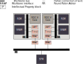

# ScratchyGen

Scratchy is an open-source tunable architecture for composing lightweight scratchpad-based multi-RISC-V SoCs. 

This repository implements a dual-core generator of a Scratchy platform.

The instructions hereunder compose and run a dual core on an Terasic DE10-Lite board with a MAX10 Intel FPGA.


Required materials are a PC with Ubuntu (18.04 LTS, 20.04 LTS, 22.04 LTS), a USB-UART cable, and a DE10-Lite board.



## Prerequisites & Environment Setup
1) Choose a directory X/X/X and create a folder named "litex_inst." Within this folder, include the following two folders:
- litex_root: https://drive.google.com/file/d/1tc-WIgzB8HCitjfIWSrWUmteWkeCNCHD/view?usp=sharing
- riscv_toolchain: https://drive.google.com/file/d/1Q0b3OWeKueiH8Nl2hm_JJ07vo7_wUG4R/view?usp=sharing
2) Open the configuration file bashrc:
```bash
gedit ~/.bashrc
```
3) Add the following lines to the bashrc file and make sure to update the path to the LITEX_ROOT and RISCV:
```bash
#
export PATH=$PATH:~/.local/bin#LITEX
export LITEX_ROOT="/PATH/TO/litex_root"
export SOC_DIRECTORY=${LITEX_ROOT}/litex/litex/soc
ls#RISCV
export RISCV='/opt/riscv'
export PATH=$PATH:${RISCV}/bin
```
4) Update the configuration file to incorporate the recent modification.
```bash
source ~/.bashrc
```
5) Create a Conda environment:
```bash
conda env create − f environment.yml
```
6) Activate the conda environment and make sure that the work is done in this environment:
```bash
conda activate litex_inst
```

7) Change Directory to PATH/TO/litex_root
```bash
cd path/to/litex_root
```
5) Giving Execution Permissions to litex_setup.py
```bash
sudo chmod + x litex_setup.py
```
6) Executing litex_setup.py Installation
```bash
./litex_setup.py --install
```
7) install verilator:
```bash
sudo apt-get install verilator
```
8)Install libevent-dev libjson-c-dev libraries
```bash
sudo apt install libevent-dev libjson-c-dev
```
9) Running Litex Simulation
```bash
litex_sim
```
10) Download and install Quartus version Quartus-lite-19.1.0.670-linux : https://www.intel.fr/content/www/fr/fr/collections/products/fpga/software/downloads.html
11) add the following line to the bashrc file and update the ALTERAPATH
```bash
#QUARTUS
export ALTERAPATH="/Path/to/ALTERA"
export QUARTUS_ROOTDIR=${ALTERAPATH}/quartus
export QUARTUS_ROOTDIR_OVERRIDE="$QUARTUS_ROOTDIR"
export QSYS_ROOTDIR="/opt/intelFPGA_lite/19.1/quartus/sopc_builder/bin"
export PATH=$PATH:${ALTERAPATH}/quartus/bin
export PATH=$PATH:${ALTERAPATH}/nios2eds/bin
export PATH=$PATH:${ALTERAPATH}/modelsim_ase/bin
```

## Updating Permissions for Board Programming
1) Change Directory to /etc/udev/rules.d
```bash
cd /etc/udev/rules.d
```
2) Create a file named "51-usbblaster.rules"
```bash
sudo gedit 51-usbblaster.rules
```
3) add the following lines into the 51-usbblaster.rules file:
```bash
# USB Blaster
SUBSYSTEM=="usb", ENV{DEVTYPE}=="usb_device", ATTR{idVendor}=="09fb", ATTR{idProduct}=="6001", MODE="0666", NAME="bus/usb/$env{BUSNUM}/$env{DEVNUM}", RUN+="/bin/chmod 0666 %c"
SUBSYSTEM=="usb", ENV{DEVTYPE}=="usb_device", ATTR{idVendor}=="09fb", ATTR{idProduct}=="6002", MODE="0666", NAME="bus/usb/$env{BUSNUM}/$env{DEVNUM}", RUN+="/bin/chmod 0666 %c"
SUBSYSTEM=="usb", ENV{DEVTYPE}=="usb_device", ATTR{idVendor}=="09fb", ATTR{idProduct}=="6003", MODE="0666", NAME="bus/usb/$env{BUSNUM}/$env{DEVNUM}", RUN+="/bin/chmod 0666 %c"# USB Blaster II
SUBSYSTEM=="usb", ENV{DEVTYPE}=="usb_device", ATTR{idVendor}=="09fb", ATTR{idProduct}=="6010", MODE="0666", NAME="bus/usb/$env{BUSNUM}/$env{DEVNUM}", RUN+="/bin/chmod 0666 %c"
SUBSYSTEM=="usb", ENV{DEVTYPE}=="usb_device", ATTR{idVendor}=="09fb", ATTR{idProduct}=="6810", MODE="0666", NAME="bus/usb/$env{BUSNUM}/$env{DEVNUM}", RUN+="/bin/chmod 0666 %c"
```
4) Create a file named "92-usbblaster.rules"
```bash
sudo gedit 92-usbblaster.rules
```
5) add the following lines into the 92-usbblaster.rules file
```bash
# The USB Blaster UDEV rules given on the Altera website at
# https://www.altera.com/support/support-resources/download/drivers/dri-usb_b-lnx.html
# did not work on Ubuntu 16.04.3 LTS (Xenial Xerus) and it appears not on Debian Jessie/Sid too.
# You may find in this file a working version of the udev rules
# Just put this files on: /etc/udev/rules.d/92-altera-usbblaster.rules ,
# then restart UDEV service:
# $ sudo udevadm control --reload-rules# For Altera USB-Blaster permissions:# USB-Blaster
SUBSYSTEM=="usb", ATTRS{idVendor}=="09fb", ATTRS{idProduct}=="6001", MODE="0666", GROUP="plugdev"
SUBSYSTEM=="usb", ATTRS{idVendor}=="09fb", ATTRS{idProduct}=="6002", MODE="0666", GROUP="plugdev"
SUBSYSTEM=="usb", ATTRS{idVendor}=="09fb", ATTRS{idProduct}=="6003", MODE="0666", GROUP="plugdev"# USB-Blaster II
SUBSYSTEM=="usb", ATTRS{idVendor}=="09fb", ATTRS{idProduct}=="6010", MODE="0666", GROUP="plugdev"
SUBSYSTEM=="usb", ATTRS{idVendor}=="09fb", ATTRS{idProduct}=="6810", MODE="0666", GROUP="plugdev"
```
6) Reload the rules
```bash
sudo udevadm control --reload-rules
```
7) Installer le USB Blaster library:
```bash
sudo apt update && sudo apt install libpng2.0
```
## Updating Permissions For USB->TTL Cable
1) Change Directory to /etc/udev/rules.d
```bash
cd /etc/udev/rules.d
```
2) Create a file named "50-myusb.rules"
```bash
sudo gedit 50-myusb.rules
```
3) Insert the following lines into the "50-myusb.rules" file and modify the idVendor and idProduct values (you can utilize "lsusb" to obtain this information):
```bash
SUBSYSTEMS=="usb", ACTION=="add", KERNEL=="ttyUSB[0-9]*",ATTRS{idVendor}=="0403", ATTRS{idProduct}=="6001", GROUP="users", MODE="0666"
```
## Scratchy Configuration

The Scratchy Dual core version offers three configurations, which can be specified in the configs.json file:
- Heterogeneous Configuration:  Core 1: femtorv, Core 2: firev. To use this option use **--config heter** while building and loading the project.
- Homogeneous Configurations:
  - Both Core 1 and Core 2 are femtorv. To use this option use **--config homo_2** while building and loading the project.
  - Both Core 1 and Core 2 are firev. To use this option use **--config homo_1** while building and loading the project.
The configuration file (configs.json) allows for modifications to the size of the RAM, ROM, SRAM, and memory scratchpad

## Scratchy use
1) Download scratchy: 
```bash
git clone https://github.com/ridope/Asymetric-Multi-Processing.git
```
2) Acces the Dual_Core folder:
```bash
cd Asymetric-Multi-Processing/Dual_Core/
```
3) Connect your board following its user manual instructions.
4) build the project 
```bash
./amp.py --build --config_file configs.json --config heter --mux
```
5) load the project
```bash
./amp.py --load --config_file configs.json --config heter --mux
```
The build and load process has been executed with a heterogeneous configuration to use other options [see Scratchy Configuration section]( #scratchy-configuration)

6) Launch Litex Terminal
```bash
litex_term /dev/ttyUSB1 
```

If you encounter any problems, [Go to Updating Permissions For USB->TTL Cable](#updating-permissions-for-usb-ttl-cable)


